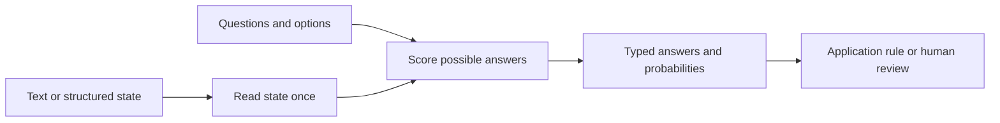

# revv

**Research toward a fast, local text decision model.** Given a state and typed questions, the intended model returns choices, yes/no probabilities, or an ordered score. This repository holds a research plan and reproducible component experiments. It does **not** yet contain a trained neural decision model or a performance win against existing models.

| If you want… | Start here | Go deeper |
| --- | --- | --- |
| Friendly explanation | [The idea](docs/start-here.md) | [Roadmap](docs/roadmap.md) |
| Evidence and competitors | [Research landscape](docs/research.md) | [Source ledger](docs/sources.md) |
| Technical design | [Architecture](docs/architecture.md) | [Evaluation contract](docs/evaluation.md) |
| Novel hypotheses to test | [Idea ledger](docs/ideas.md) | [Next steps and gates](docs/next-steps.md) |
| Challenge a promising result | [Red-team ledger](docs/red-team.md) | [Evaluation contract](docs/evaluation.md) |
| Feasibility and compute costs | [Analytical screen](docs/feasibility.md) | [Roadmap](docs/roadmap.md) |
| Free GPU setup | [Kaggle connection](docs/kaggle.md) | [Roadmap](docs/roadmap.md) |
| To review an experiment | [Next steps and gates](docs/next-steps.md) | [Experiment template](templates/experiment.md) |
| See what happened so far | [Findings in plain English](docs/start-here.md#what-the-first-experiments-found) | [Raw experimental records](codex/RESUME.md#verified-evidence-and-current-status) |
| To resume in Codex | [Codex handoff](codex/README.md) | [Current brief](codex/RESUME.md) |

**Research question:** can an **under-8 GiB peak-memory** local CPU process make typed text decisions faster, with acceptable or superior accuracy and probabilities, than eligible open decision models on the **same tasks and hardware**? A separate **under-4 GiB quantized profile** tests more constrained devices without weakening the primary quality comparison. Hosted Jev is a separate quality comparator; its network time is not a local CPU speed result. “Fastest” will always be qualified by hardware and workload.

**Initial choices:** Python for research and training, ONNX Runtime for first CPU inference; consider a Rust wrapper only after profiling. English text first; multilingual and multimodal claims need separate tests. No benchmark has yet established a win.

`docs/` connects accessible and expert notes; `experiments/` holds preregistered methods and small aggregate/hashed outcomes; `analysis/` contains reproducible scripts; `codex/` preserves the [original mission prompt](codex/ORIGINAL_PROMPT.md) and current handoff. Add `src/`, `tests/` and `bench/` when a trained candidate is ready. Keep large weights, datasets, credentials and personal data out of Git. Research snapshot: **27 September 2026**; pin source revisions before experiments.
