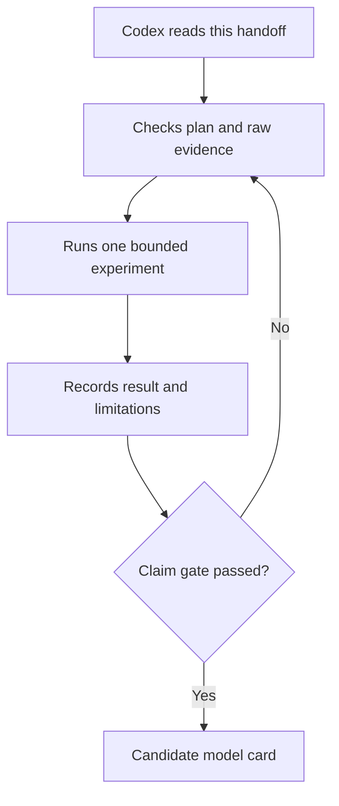

# Continue the revv mission

**[Home](../README.md) · [Plain-English idea](../docs/start-here.md) · [Technical design](../docs/architecture.md)**

This folder is the starting point for a new Codex session. It contains the present facts, working rules and a prompt you can paste into Codex. It is updated as experiments produce results.

| Need | Read | Why |
| --- | --- | --- |
| Tell Codex what to do | [Pasteable prompt](PROMPT.md) | Start a fresh session. |
| See the actual state | [Resume brief](RESUME.md) | Evidence, current run and next action. |
| Keep experiments honest | [Working rules](WORK_RULES.md) | Spending gates and evidence standards. |
| Understand the idea | [Plain explanation](../docs/start-here.md) | Reader-friendly goal and diagrams. |
| Check detailed design | [Architecture](../docs/architecture.md), [evaluation](../docs/evaluation.md) | Architecture and claim criteria. |
| Review the experiment | [Forward-pass pilot](../experiments/kaggle/2026-09-27-forward-pilot.md) | Preregistration and eventual verdict. |
| Check first labelled dataset | [CLINC audit](../experiments/data/2026-09-27-clinc-audit.md) | Rights, splits and overlap before model training. |

When Codex finishes a milestone, update `RESUME.md` and the relevant experiment record with exact run and artifact links, measured outcomes, failures and one concrete next action. Preserve unsuccessful results. Keep this folder concise and link to durable source documents instead of copying them.
