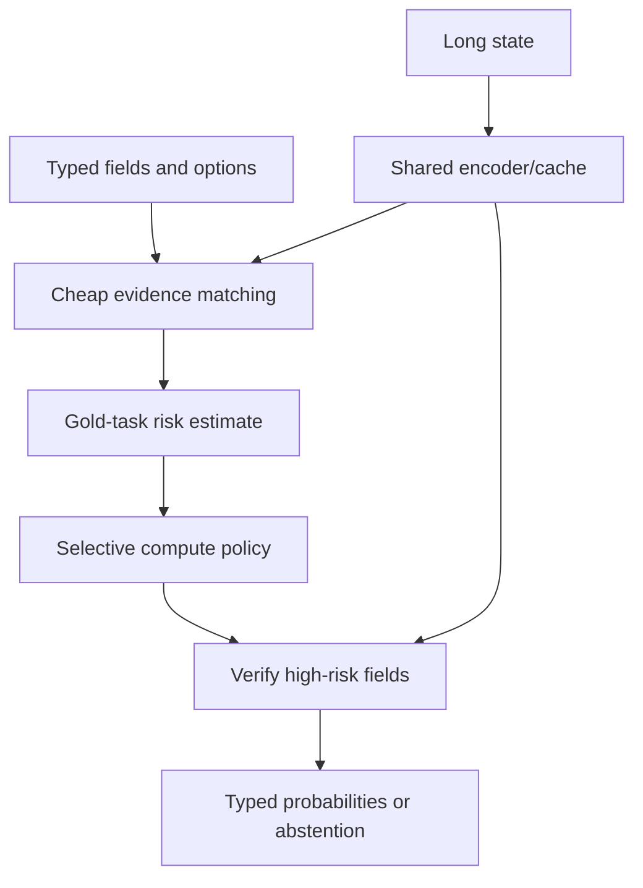
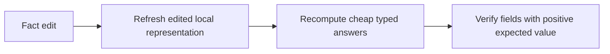

# Architecture hypotheses

**[Home](../README.md) · [Plain-English view](start-here.md) · [Research](research.md) · [Novelty audit](novelty-audit.md) · [Ideas](ideas.md) · [Evaluation](evaluation.md)**

The mission is a very fast local model for typed text decisions. The design must earn both quality and speed. Small size, GPU throughput or agreement with a model's own full-depth answer is not enough.

## Candidate to screen: shared state and selective typed verification

Encode a long state once into token or sentence features. Each request-time field first uses a low-cost typed scorer. If that field's calibrated risk warrants it, run question-conditioned evidence verification over selected cached spans or a compact field-specific adapter, then return a choice/boolean/ordinal distribution or abstain. Minimal fact-edit pairs with verified changed-field masks supervise sensitivity and stability.

Candidate backbones include ModernBERT-like bidirectional encoders and compact recurrent/state-space models such as Primus Decision. Do not commit to ModernBERT solely because it is named in the original prompt: compare size, preprocessing, CPU kernels, long-state behavior and task quality first. Laya, Kev, Typical, Decider, Primus and RSI-Jev are direct baselines where task contracts align.

A CLIP-style dual encoder is a candidate for the cheap field/evidence match, not a foregone choice. Train it only if exact support evidence and hard negatives are available and retrieval recall clears a preregistered floor. Our untrained token-MaxSim pilot lost to pooled scoring, and earlier ContractNLI evidence retrieval did not establish a deployable verifier. A high-scoring cheap retriever with missed decisive evidence cannot be repaired by downstream confidence.

## Risk-priced verification and shared cost

For a request with features $x$, question $q$ at depth $d_q$ has estimated conditional task loss $r_q(x,d_q)$ and measured or profiled branch cost $B_q(x,d_q)$. Advancing the shared state encoder once to depth $m$ costs $A_x(m)$, where $m=\max_q d_q$. The separable expected-loss objective is:

$J_x(\mathbf d)=\sum_qr_q(x,d_q)+\lambda\left[A_x(\max_qd_q)+\sum_qB_q(x,d_q)\right].$

Interpret each depth $d_q$ as a verification stage: cheap typed match, selective evidence cross-attention, then optional full field verifier. Choose $\lambda$ on development data to expose a latency/task-risk frontier, not on locked labels. Estimate $r_q$ against gold task labels, using cross-fitting and a separate calibration split; confidence or agreement with the final model is only an input feature. Evaluate request-level any-error rate separately because it is not separable.

For a per-field stage change from $k$ to $k+1$, the Lagrangian test is:

$r_q(x,k)-r_q(x,k+1)>\lambda\left(B_q(x,k+1)-B_q(x,k)\right).$

In words, spend more only when the expected gold-loss reduction exceeds the measured extra compute price. With no shared-depth term and no hard bundle cap, this decision separates by field. A hard per-request budget couples fields and becomes a small discrete allocation problem; a shared deeper trunk reintroduces the maximum-depth cost handled by the exact $O(QL)$ solver below. Measure which regime the implementation actually has.

For each possible maximum depth $m$, define $g_q(x,d)=r_q(x,d)+\lambda B_q(x,d)$ and $G_q(x,m)=\min_{d\le m}g_q(x,d)$. One question must reach $m$, so force the least-cost question to do so:

$J_{x,m}=\lambda A_x(m)+\sum_qG_q(x,m)+\min_q[g_q(x,m)-G_q(x,m)].$

Choose the minimum across $m$. This gives an exact $O(QL)$ allocator for the stated additive objective. See [analysis/check_shared_cost_solver.py](../analysis/check_shared_cost_solver.py), which checks it against exhaustive search on deterministic randomized small problems. The derivation assumes additive per-question loss, deterministic cumulative costs and no unmodeled joint execution overhead. If all fields use the same shared encoder depth, the maximum-depth externality remains. If only the state cache is shared and verifiers are separate, the shared cost is constant and a request budget becomes a small multiple-choice knapsack; compare against independent thresholds. Do not force a joint optimizer where it adds no value.

## Why bundle size matters

If per-question exit depth has cumulative distribution $F$, then under independence the probability that the whole bundle exits by layer $m$ is $F(m)^Q$. Real question difficulty is correlated, so this is only intuition; measure maximum depth by actual request bundle.

Example, not a measurement: if each question has an 80% chance of exiting by layer $m$, only about 33% of five-question bundles and 1.2% of twenty-question bundles have every branch exit by that layer. Average exit rate alone cannot show shared-encoder savings.

## Candidate comparison matrix

| Path | Shared trunk | Question head | Purpose |
| --- | --- | --- | --- |
| Full-depth shared | One state pass to final layer | All questions score at final depth | Accuracy and latency reference |
| Fixed shallow tap | One state pass to chosen depth | All questions score there | Static early-depth baseline |
| Independent threshold | Questions choose exits separately | Each q uses confidence/stability gate | Tests joint cost accounting |
| Intervention/risk-gated verification | State cached once | Only high-risk typed fields pay verifier cost | Candidate weave to screen |
| Direct compact model | Architecture-specific | Native typed outputs | Strongest practical competitor |
| IPPD on generative models | Shared context in one packed prompt | Parallel autoregressive outputs | Relevant GPU prior art, not the same CPU typed task |

For adaptive execution, verify dynamic compaction or bucketing. Merely masking exited questions in a dense batch may save no CPU work.

## Intervention-supervised training idea

For each verified state edit $e$, annotate the field set $A(e)$ whose gold labels change. At each stage $k$, supervise both factual/counterfactual gold distributions and regularize only unaffected fields:

$L=\sum_{(s,\mathbf y)}\sum_{q,k}\alpha_k CE(p_{q,k}(s),y_q)+\beta\sum_{(s,s^e),k}\sum_{q\notin A(e)}JS(p_{q,k}(s),p_{q,k}(s^e)).$

The labels for both pair members teach affected fields to flip; the masked Jensen-Shannon term controls spillover elsewhere. Option-to-evidence contrastive loss is optional and requires reliable proof spans. This is close to published counterfactual and QA-consistency methods; only the verified sparse field mask coupled to stage-specific risk routing is being tested as a possible new interaction.

## Follow-on hypothesis: local rebase before verifier routing

This is a separate research candidate, not part of the frozen synthetic screen. After an edit, refresh the edited span and known dependent representation first. Then route only the expensive verifier by expected gold-loss reduction per measured CPU cost. If the model cannot bound which local representations depend on an edit, enlarge the refresh region or run the full encoder.

For field $j$, estimate the change in expected task loss from verification:

$V_j=\mathbb E[L(p_j^{local},y'_j)-L(p_j^{verify},y'_j)\mid x_j]$.

With independent per-field cost $c_j$, a Lagrange policy verifies when $V_j>\lambda c_j$. At a fixed cardinality budget, choosing the highest expected loss reductions is optimal by an exchange argument. If fields share retrieval or batching costs, optimize the measured set cost; independent gates may waste budget. The current registered screen tests $P(y'_j\ne y_j)$, which is only a proxy for this value because a verifier may fix or damage the cached answer.

A low-rank edit-to-logit correction is an optional ablation. Let $h$ be the cached state feature and $\delta h$ the feature change produced by an exact local update. For a smooth typed logit head $z_j$, first-order expansion gives
\n
$\Delta z_j = J_j(h)\delta h + r_j$, with $\|r_j\|_2\le \frac{L_j}{2}\|\delta h\|_2^2$ when the Jacobian is $L_j$-Lipschitz along the edit path. Replacing $J_j$ with a rank-$r$ approximation $\widehat J_j$ adds at most $\|J_j-\widehat J_j\|_2\|\delta h\|_2$ to this bound. If the resulting per-logit error is at most $\epsilon_j$, a predicted post-edit top-two margin greater than $2\epsilon_j$ preserves the top class. This is a valid skip certificate only when those are genuine error bounds. Empirical residual quantiles are calibration evidence, not formal bounds under distribution shift.\n\nThe first mathematical gate is therefore to measure edit-feature error, Jacobian-tail error, curvature residual and rank-versus-latency on held-out edit types. If those errors are not small enough to preserve decisions at a useful fraction of fields, drop the delta shortcut and keep exact local refresh. Repeated edits also need drift measurements and a periodic exact rebase or calibrated full-recompute fallback. None of these mechanisms has been validated on an independent workload yet.

## Stability and risk

A margin-versus-drift bound can prove that an early head has the same argmax as the final head on the event every probability coordinate stays within a calibrated $\delta$. It does not prove the shared answer is correct. Keep it as an agreement diagnostic.

Primary risk measures are gold-task loss, probability quality, abstention coverage and request-level probability of at least one incorrect decision. Calibrate on separate bundles grouped by state, source and question composition; keep locked tests unopened until the policy is fixed.

## Ablation order

1. Profile a shared context pass, typed field head, evidence retrieval and cross-attention verifier separately. If per-field work is negligible, stop the routing idea.
2. Build grouped RuleTaker/ProofWriter examples with theorem-prover gold evidence, fact edits and verified affected-field sets.
3. Collect cheap and deep outputs, gold loss and end-to-end CPU costs without updating the backbone.
4. Compare cheap-only, fixed verification, per-field margin threshold, calibrated task-risk routing and direct compact models on Q=1/5/20.
5. Train intervention/contrastive/risk components only if the frozen probe shows an external-source quality gap and useful branch-level compute headroom.

Training and export details are gated in [next steps](next-steps.md); the task contract and memory limits are in [evaluation](evaluation.md).
