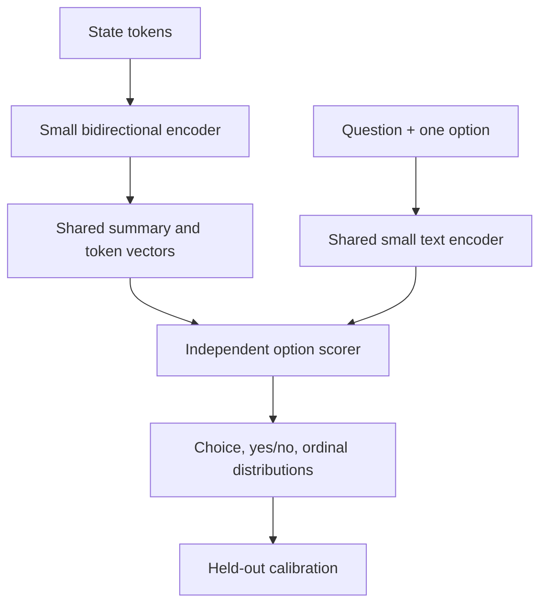

# Architecture hypotheses

**[Home](../README.md) · [Plain explanation](start-here.md) · [Evidence](research.md) · [Tests](evaluation.md)**

The [conditional evidence reuse hypothesis ledger](ideas.md) records a possible novel task-specific combination, its closest known alternatives and cheap falsifiers. It is not a validated model.

## First candidate: a shared-state decision encoder

Start with existing pretrained small text encoders. Use ModernBERT-base (149M parameters) and a larger encoder as **quality references**, not automatic final choices. A roughly 30–100M-parameter student remains a possible speed target, subject to checkpoint and license review; the 8 GiB limit permits stronger models if they justify their latency. Encode the state once; encode each `(question, option description)` through shared weights or a smaller branch; compare it with the state summary and, optionally, selected token vectors. First test a pooled dual encoder and a conventional concatenated cross encoder as controls. [Screen their theoretical costs first](feasibility.md).

Let state vectors be summary `u` and tokens `h_i`, and option/question vector be `v_j`. A candidate logit could be `z_j = wᵀ[u; v_j; u⊙v_j; max_i(h_iᵀWv_j)] + b`. The token interaction is an **ablation** to test evidence sensitivity. For `K` choices, `p_j = softmax(z_j/T)`. Train an explicit `NONE` option and separate answerability judgement with real missing-evidence cases. For ordinal levels `r=0…R−1`, return a distribution and expected normalized score `Σ_r r·p_r/(R−1)`. Yes/no can use two explicit candidates or a binary head; compare both.

Independent candidate logits are equivariant to option permutation if preprocessing has no positional feature. Normalization can still change probabilities when the *set* of options changes; tests must verify order invariance in the actual implementation. Question batching must not leak one question's content into another.

Approximate compute is `C_state(L) + QK·C_candidate(m) + O(QKLd)` for state length `L`, question count `Q`, options `K`, candidate length `m` and width `d`. Selecting `r≪L` token vectors could reduce the last term but may discard the decisive evidence. A conventional cross encoder repeats joint state/question/option work approximately `QK` times. This motivates the idea; it is **not a latency measurement**. One short state with two options may favor the cross encoder.

## Controlled ladder

| Stage | One change | Continue only if… |
| --- | --- | --- |
| A | Majority/chance, lexical classifier, frozen encoder head, pooled dual encoder, small cross encoder | Data, latency and memory pipeline are valid. |
| B | Fine-tune shared-state scorer with supervised cross-entropy and ordinal labels | Held-out new-source quality and memory justify more complexity. |
| C | Contrastive alignment with verified positives and hard counterfactual negatives | Unseen-criteria and negation gains outweigh confident errors. |
| D | Distil a large teacher on training-only examples | Paired improvement at matched inference budget; track teacher lineage and overlap. |
| E | Token interaction, adaptive chunking or a selective second pass | Errors motivate it; report extra latency and worst-case memory, including cascaded cases. |
| F | ONNX export and INT8 CPU quantization | Export parity, speed, accuracy and calibration hold on the final artifact. |

Supervised log loss is a proper scoring objective; Brier or decision-focused losses are later ablations. Calling a method “RLCD” does not establish calibrated probabilities: [Laya's published refit](sources.md#s7) is a caution. Fit a temperature or simple calibrator on a **separate calibration split**, then evaluate on locked test once.

## Memory and implementation language

149M parameters at 16 bits represent roughly 298 MB of weights, or 149 MB at 8 bits (decimal MB). A 4B model at 16 bits needs at least 7.45 GiB of weight bytes alone, leaving too little room under an 8 GiB total-process target; 4-bit weights start at 1.86 GiB before scales and runtime. Tokenizers, libraries, activations, mappings and concurrency add to this. The **actual peak process RSS** decides eligibility for both 8 GiB primary and 4 GiB quantized profiles. [Exact arithmetic and caveats](feasibility.md).

Use **Python** for research, data preparation, PyTorch training, calibration and reproducible evaluation. Try **ONNX Runtime** first for local CPU inference and dynamic INT8 quantization because its [official guide](sources.md#s11) recommends that path for transformers. Compare exported and reference outputs. Add **Rust** for a thin service or tokenizer boundary only if profiling shows measurable overhead, retaining golden-vector parity. English first keeps failure analysis tractable; multilingual routing, weights and calibration have their own gate.
