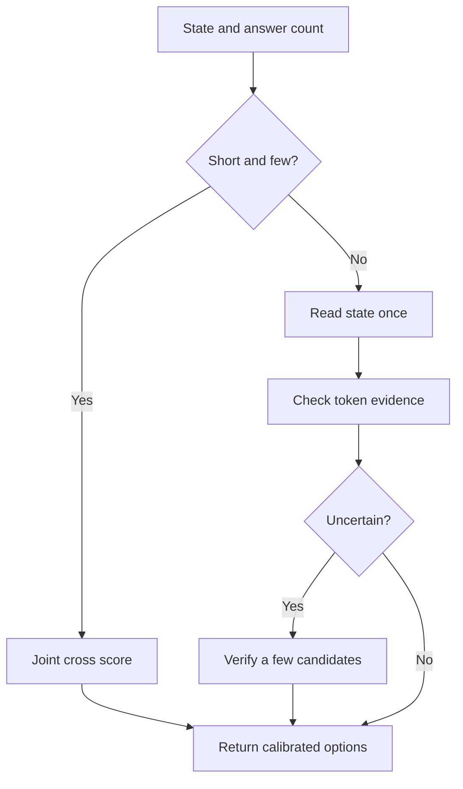

# Hypothesis ledger: conditional evidence reuse

**[Home](../README.md) · [Plain explanation](start-here.md) · [Architecture](architecture.md) · [Evaluation](evaluation.md) · [Codex research charter](../codex/MISSION.md)**

This page records ideas to falsify, not product features or claims of previously unknown invention. Before calling an idea novel, search its closest prior art and show which *measured* difference remains. The first synthesis joins state reuse, token-level evidence matching, calibrated deferral and workload-aware routing.

## In plain English

When there are only two answers to a short question, reading the whole text with each answer can be quick and sensitive to details. When 40 answers share one long text, rereading that text 40 times is wasteful. An experimental model could choose the cheaper route, inspect individual words when a summary is ambiguous, and ask a stronger scorer to verify only uncertain cases.

## Precise hypothesis and prior art

**CER-1, conditional evidence reuse:** share one encoder body for a state and its candidate descriptions, score pooled vectors, and optionally use a small question-conditioned set of state token vectors for late interaction. Route short, low-option requests to a joint cross encoder. Route uncertain high-option requests to a *bounded* cross verification of the top `k` candidates; include a separate `NONE`/defer mechanism. The router can be a fixed workload rule at first, avoiding an extra trained selector. This is a proposed combination and task adaptation, **not a claim that late interaction, cascades, dynamic routing or abstention are new individually**.

Closest sources: [ColBERT](https://arxiv.org/abs/2004.12832) introduces token-level late interaction; [token-pruning analysis](https://arxiv.org/abs/2403.13291) tests inexpensive pruning; [dual intent encoders](https://arxiv.org/abs/2003.04807) already apply shared representation to intent detection; [ModernBERT](https://arxiv.org/abs/2412.13663) brings efficient encoder design; [calibrated deferral](https://arxiv.org/abs/2202.03673) shows that a defer probability needs careful treatment. [Cascade Transformer](https://aclanthology.org/2020.acl-main.504/) already prunes candidates while sharing partial transformer encodings. [BoundaryMORPH](https://arxiv.org/abs/2609.27213) allocates bounded cross-encoder calls near a retrieval set's decision boundary; its objective differs from our calibrated typed decision, but budgeted verification itself is prior art. Check additional selective-reranking and decision-model papers before asserting architectural novelty. The [synthetic T4 pilot](../experiments/kaggle/2026-09-27-forward-pilot.md) supports a workload crossover question, not any quality claim.

## Cheap cost and correctness screens

Let `L` be state tokens, `m` candidate tokens, `N=QK` candidate decisions, `r` retained evidence tokens, `p` the fraction of requests sent to verification, and `k` verified candidates. Let `E(x)` be an encoder pass and `I(r,m)` a cheap token interaction. An optimistic upper-level work model is

`C_shared = E(L) + N E(m) + N I(r,m) + p k E(r+m) + C_gate`, versus `C_cross = N E(L+m)`.

Use a shared path only when **measured** time including tokenization and gate overhead is lower, and when its paired quality/calibration meets the predeclared floor. A very large `p`, ineffective `r`, or small `N` can erase its advantage. Joint cross verification can also change answer probabilities; recalibrate the *whole route mixture*, not only each head. Candidate order must not enter the router, and all options must be scored symmetrically before any top-`k` decision.

**Candidate-recall bottleneck:** if the first stage includes the right in-scope answer among the `k` verified candidates with probability `R@k`, then even a perfect verifier cannot achieve closed-set accuracy above `R@k` on those cases. Record `R@k` before training a verifier, including recall under negation and reordered options. An `oos` / not-mentioned answer needs its own calibrated path; a top-`k` guarantee says nothing about detecting missing evidence. This is a mathematical ceiling, not a measured CER-1 result.

| Stage | Matched control | Cheap falsifier / decision |
| --- | --- | --- |
| Workload routing | Always cross; always pooled shared | End-to-end CPU crossover at 1/2/5/20 options and short/long states; routing overhead included. |
| Token evidence | Pooled shared; all-token late interaction | Negation/missing-evidence errors and throughput; whether retained evidence drops the decisive clause. |
| Selective verification | Always verify; never verify | Error versus verification coverage at a predeclared risk cap, with p95 and worst-case memory. |
| Calibration and abstention | Same architecture without gate; explicit `NONE` | Domain-shift Brier, OOS recall and selective risk; confident wrong answers fail. |

The first [CLINC audit](../experiments/data/2026-09-27-clinc-audit.md) supports testing many candidate labels and an OOS answer, but a single utterance has no multi-question long document. Require a second evidence-grounded, multi-question dataset before claiming that the complete design works. Pause after each cheap falsifier; train only the part whose potential gain survives its control.

**Next dataset candidate:** [ContractNLI](https://github.com/stanfordnlp/contract-nli) annotates 17 hypotheses per contract with entailment, contradiction, not-mentioned and evidence spans across 607 contracts; its author paper describes exception/negation difficulties. It directly tests state reuse and missing evidence, unlike CLINC. Review split provenance, download conditions, token-length truncation and document-level leakage before using it. QASPER has multiple evidence-labelled questions over papers, but answer types include free text, so a narrow typed subset would need explicit preregistration. Neither dataset automatically validates production legal decisions.

The first discriminating [frozen encoder pilot](../experiments/kaggle/2026-09-27-frozen-matching.md) isolated pooled versus token evidence under one pretrained checkpoint and fixed public development split. **Untrained MaxSim lost 3.27 points in paired known-intent accuracy** and took about 4.9 times as long for the synchronized GPU scoring kernel, without OOS improvement. Reject it for the default *untrained label-name* route; evidence-trained token interaction remains an open hypothesis. The subsequent [class-prototype screen](../experiments/kaggle/2026-09-27-prototype-screen.md) raised known closed accuracy from 70.94% to 91.12% and retained the correct answer in top five 99.00% of the time on CLINC development. This suggests candidate representation, rather than token comparison, was the bottleneck for this task; it does not prove a causal mechanism or generalization. These are component screens, not trained CER-1 evaluations or local CPU superiority.
