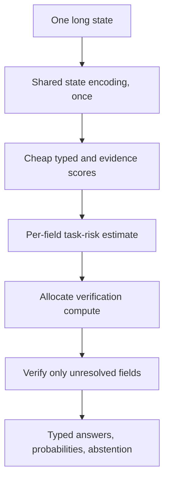

# Novelty audit: a sharper weave after the third overlap pass

**[Home](../README.md) · [Plain-English view](start-here.md) · [Hypothesis ledger](ideas.md) · [Technical design](architecture.md) · [Next steps](next-steps.md) · [Codex handoff](../codex/RESUME.md)**

Research snapshot: 27 September 2026. This audit asks whether we can weave familiar building blocks into a distinct, useful local typed-decision method, and what cheap test could disprove it.

## In plain English

When one long document has many typed questions, repeatedly running a full question-document encoder is wasteful. A shared text encoding can be reused, but simple per-question early exits are already close to AdaMTL, global QA compute allocation, and multi-question inference.

The stronger weave now worth screening is **intervention-supervised selective verification over one shared state**: cache a compact representation of the state once; score each field and its options cheaply, potentially with a CLIP-style question/option-to-evidence match; use verified fact edits to teach which fields should change and which should stay stable; send only high-risk fields to a more expensive evidence verifier. A small risk controller should predict reduction in **gold-task error per measured CPU cost**, not agreement with a deeper model. This combines established techniques, so the possible novelty is in their task-specific interaction and evidence—not in any single component.

## Close prior art changes the claim

| Work | What it already does | What is still different here |
| --- | --- | --- |
| Wu et al., EMNLP 2020, [adaptive computation for open-domain QA](https://aclanthology.org/2020.emnlp-main.244/) | Early exits and a learned global policy allocate compute among retrieved passages for one answer. It reports 4.3× lower compute at 95% of full-model performance on SQuAD-Open. | It allocates across passages; this proposal allocates depth across multiple typed outputs over a shared state representation. Still a close resource-allocation precedent. |
| Glavas et al., [IPPD](https://arxiv.org/abs/2609.05707), 2026 | Packs many questions about common contexts into one autoregressive prompt and shares attention/memory work. It reports throughput gains on GPU LLM workloads. | It targets generative GPU throughput with parallel decoding, not one-shot typed probabilities, local CPU latency, task-risk allocation, or early stopping per decision branch. It defeats a broad claim that sharing context across questions is new. |
| Kaplan, [deployment-specific early exits](https://arxiv.org/abs/2609.14144), 2026 preprint | Trains intermediate readouts and tunes exit thresholds for deployment traffic; shows token fidelity can conceal task-answer failures. | It is token generation rather than typed decisions over a request bundle. It means we must judge actual task loss, not only agreement or logit drift. |
| Neseem et al., [AdaMTL](https://arxiv.org/abs/2304.08594) and [official code](https://github.com/scale-lab/AdaMTL) | A shared vision encoder has task-aware block and token controllers; task masks are combined so shared computation runs when any task needs it. | Close precedent for task-specific compute over a shared representation. Its tasks are dense visual outputs and its objective targets active block/token fractions, rather than typed text fields with per-field gold-error risk and intervention labels. The broad shared-cost/per-task-routing idea is already occupied. |
| Ye et al., [TR-BERT](https://aclanthology.org/2021.naacl-main.463/), Abdalla et al., [Token-Selective Attention](https://arxiv.org/abs/2605.05222), and Ainslie et al., [CoLT5](https://aclanthology.org/2023.emnlp-main.309/) | Dynamically allocate layers or heavier computation across tokens. | Token-level sparsity is not new. Any token-routing variant needs a task-specific reason and a baseline against these methods. |
| Soldaini and Moschitti, [Cascade Transformer](https://aclanthology.org/2020.acl-main.504/), and [EEE-QA](https://arxiv.org/abs/2403.02176) | Stage answer/evidence candidates through cheaper and more expensive rankers; share partial encodings and account for question-answer interactions. | Cheap-score/deep-verifier cascades are established. A new claim must center on what intervention masks and typed bundles add under equal quality and local CPU timing. |
| [Nimble](https://github.com/bespokelabsai/nimble) | A direct typed System-1 model accepts a schema with multiple fields; its MLX scorer processes one shared context once and scores fields in parallel. Each field is isolated from other answers. Its curation also creates near-identical fact-edit pairs that change the target decision. | Strong direct overlap on multi-field typed scoring, shared context, and basic counterfactual data. Its released 9B weights are about 18 GB before runtime overhead; current Mac path requires a large-memory Apple Silicon machine and does not support quantized weights. It does not describe per-field adaptive exits or joint shared-cost depth allocation. Labels in its small published holdout are synthetic and unreviewed. |
| [Primus Decision](https://huggingface.co/The-Aame/primus-decision-0.1), [RSI-Jev](https://huggingface.co/shgao/rsi-jev-v1.0-qwen3.5-0.8b), [Typical](../docs/sources.md#s29) and other typed systems | Tiny structured models, contextual option scoring, teacher distillation and fixed intermediate taps already exist. | They remain direct quality and local CPU baselines. The project must win a matched comparison, not just combine their vocabulary. |

Nimble is a particularly close typed-decision prior: it already shares a context pass across multiple typed fields and publishes minimal fact-edit pairs. AdaMTL goes further than our earlier ledger suggested: its task-specific controllers route computation through a shared encoder and merge demands so shared work is done if any task requests it. The Cascade Transformer already shares partial encodings among progressive rankers. Therefore none of these is a novelty claim on its own: shared fields, task-specific compute, cascades, contrastive scores, or fact edits.

The **possible remaining interaction** is narrower: use an exact sparse intervention mask over a typed question bundle to train *gold-label sensitivity* at each verification stage; then allocate measured local CPU work only to fields whose calibrated task-error risk is expected to drop enough. This is a plausible weave of shared encoders, CLIP-like evidence matching, typed System-1 outputs, counterfactual supervision, and adaptive compute. It is not yet a novel-architecture claim. The task-by-task combination appears less directly covered than the ingredients, but a direct code/literature review and a matched experiment could still show it is routine or unhelpful.

## Candidate weave and first-principles cost model

Let $Q$ be the number of questions and $L$ the number of candidate exit depths. For question $q$ exiting at depth $d_q$:

- $A(m)$ is measured cumulative cost of the shared state encoder through depth $m$.
- $B_q(d_q)$ is measured cumulative cost of question $q$'s branch through depth $d_q$.
- $r_q(d_q)$ is estimated expected **gold-task loss** at that depth.
- $m=\max_q d_q$ because the shared encoder must reach the deepest branch.
- $\lambda$ converts runtime cost into the same objective scale as task loss.

For separable expected loss, choose depths to minimize

$J_x(d_1,\ldots,d_Q)=\sum_q r_q(x,d_q)+\lambda\left[A_x(\max_q d_q)+\sum_q B_q(x,d_q)\right].$

This captures a second-order effect missed by independent thresholds: a shared layer is paid once if any question needs it, not once per question. The local branch cost is paid for each question that continues. In the proposed evidence cascade, B_q must be substantial enough to matter (for example, question-to-evidence cross-attention). If the field head is only a tiny linear layer, its savings are negligible; a question-specific exit then does not justify a complicated scheduler. If all branches use one cached shared encoding and have no deeper shared layers, use a constant shared cost A and measure per-field verifier costs directly rather than forcing the max-depth model.

The optimization has an exact reduction under this additive objective. For a fixed deepest depth $m$, define $g_q(x,d)=r_q(x,d)+\lambda B_q(x,d)$ and $G_q(x,m)=\min_{d\le m}g_q(x,d)$. At least one question must actually use depth $m$. Therefore the best objective with maximum depth exactly $m$ is

$J_{x,m}=\lambda A_x(m)+\sum_q G_q(x,m)+\min_q\left[g_q(x,m)-G_q(x,m)\right].$

Evaluate $J_m$ for each $m$ and choose the minimum. Prefix minima make the solver $O(QL)$. This is exact for the stated additive objective; it is **not** an exact solution to an arbitrary family-wise risk constraint or a model-quality guarantee. The derivation was checked against exhaustive depth-vector search on 3,000 randomly generated small cost/loss problems; maximum objective discrepancy was floating-point round-off ($3.6\times10^{-15}$). The reproducible checker is [analysis/check_shared_cost_solver.py](../analysis/check_shared_cost_solver.py).

If outputs are batched densely, exited branches may still consume compute unless the runtime compacts or buckets remaining questions. The scheduler must include measured exit/compaction overhead $H$. If $H$ depends jointly on the chosen exits, the exact reduction no longer applies unchanged. Measure the real execution path.

## The question-count trap

If each question independently has exit-depth CDF $F$, then the chance every question exits by layer $m$ is $F(m)^Q$. For illustration only, if 80% of questions exit by layer $m$, the chance all five do is $0.8^5\approx33\%$, while for twenty it is $0.8^{20}\approx1.2\%$. These are not project measurements. Correlated question difficulty changes the numbers; measure actual bundles directly.

Thus report both average question depth and the distribution of maximum depth per bundle. With larger bundles, a shared trunk may still run nearly to completion even when most individual branches are shallow. The scheme may then save branch work but little state-encoder work.

## Risk and correctness

Full-model agreement is a useful diagnostic, not a quality target. Early and full outputs can agree and both be wrong. Report separately:

1. gold-task loss by question and probability a request bundle contains any wrong answer;
2. probability quality (Brier, NLL, reliability) and abstention/selective risk;
3. early-versus-full disagreement and distribution drift;
4. measured end-to-end latency, including tokenization and policy overhead.

The additive solver minimizes per-request estimated expected question loss. A request-level “any answer wrong” constraint is non-separable; evaluate it on separate held-out bundles or use a rigorously calibrated risk-allocation method. Do not label an empirical calibration curve a formal guarantee under distribution shift.

## Training signal: sparse intervention locality

For a valid minimal edit $e$ to state $s$, let $A(e)$ be the fields whose correct labels change under the intervention. A generated or verified pair gives $(s,\mathbf y)$ and $(s^e,\mathbf y^e)$. Across exit stages $k$, a candidate training loss is

$$L=\sum_{(s,\mathbf y)}\sum_{q,k}\alpha_k CE(p_{q,k}(s),y_q)+\beta\sum_{(s,s^e),k}\sum_{q\notin A(e)}JS(p_{q,k}(s),p_{q,k}(s^e)),$$

where the supervised term includes both members of each pair, and the consistency term applies only to fields whose labels are verified to remain unchanged. Optional CLIP-style evidence matching can add an InfoNCE loss between a field/option representation and a proof-supported sentence, with hard negative sentences. Use it only when evidence-span recall is high enough to justify the assumption.

This does not claim that counterfactual, contrastive, or consistency learning is new. Nimble already curates fact edits for typed decisions; PairCFR combines counterfactual pairs and contrastive learning; [PairCFR](https://aclanthology.org/2024.acl-long.646/) combines counterfactual pairs with contrastive learning; [TACL work on minimally edited QA](https://aclanthology.org/2023.tacl-1.61/) adds query-side contrast consistency; logic-guided QA adds cross-question regularization. The possible distinction is the **verified sparse affected-field mask used to supervise every typed field across an evidence-verification cascade**, then calibrating each stage against actual task labels. This is an unverified combination, not a novelty result.

Test this first as a **measurement**, not training: build grouped questions from RuleTaker/ProofWriter with theorem-prover-verified labels and evidence, edit one fact, and compute the exact affected-field set. Measure target-field flip accuracy, unaffected-field probability spillover, evidence retrieval recall and escalation coverage on held-out rule compositions. Use ContractNLI only as a realistic transfer/stress set: earlier evidence screens did not establish a deployable retriever, so it cannot be treated as a solved evidence source. A wrong affected-field mask teaches a false relation.

## Hypotheses and kill criteria

| Hypothesis | Cheapest discriminator | Kill or reframe if… |
| --- | --- | --- |
| Intervention-supervised selective verification improves the typed risk/latency frontier. | First profile shared encoding versus per-field scoring/verifier cost. Then compare cheap-only, fixed verifier, confidence-gated verifier and task-risk-gated verifier on held-out intervention bundles. | The cheap stage lacks evidence recall, field refinements are too cheap to matter, the risk controller does not beat tuned margins, or compute overhead erases CPU savings. |
| Bundle-level field routing remains useful as question count grows. | Compare $Q=1,5,20$, grouped by state; report shared encoding cost, verifier calls, maximum shared depth and end-to-end p95 separately. | One hard field forces costly shared refinement for almost every bundle, or per-field work is too small for routing to pay. |
| The policy beats the strongest compact typed baseline on a real local workload. | Matched CPU test against Primus, RSI-Jev, Laya, Kev, Typical and Decider when contracts match. | A direct compact model already meets the quality, calibration, latency and RSS gates. |
| Sparse intervention locality improves decision bundles without harming ordinary accuracy. | Generate exact fact-edit pairs with a verified affected-field mask; measure target flips and unaffected-field spillover before training. | The baseline has little spillover, the edit/mask is ambiguous, or logic-guided/contrast-consistency methods already cover the exact setup. |
| A small risk readout predicts which extra layer is worth its cost. | Compare margin, entropy, inter-layer change, evidence coverage and a cross-fitted small risk head. Keep test labels locked. | Extra prediction costs more than it saves, fails by source/Q/type, or improves agreement but hurts gold-task accuracy. |

## Fifth overlap pass: counterfactual components and shared routing

Primary-source checks add three boundaries. COAR (ICML 2024) estimates counterfactual effects of internal model components and uses them for model editing; it does not intervene on the input and decide whether a cached typed answer benefits from refresh. SNR (AAAI 2019) learns task-dependent routes through shared subnetworks, so learned routing over shared computation is established. Incremental NLU work with recurrent Linear Transformers studies arriving prefixes and trades some final-sequence quality for faster incremental output; it does not cover arbitrary edits or selective repair of a typed output bundle. See [S71–S73 in the source ledger](sources.md#fifth-overlap-pass-counterfactual-component-modeling-and-shared-routing).

These findings remove component attribution, task routing, and incremental processing as standalone novelty claims. The narrow remaining interaction is a **testable question**, not a novelty result: can verified input-edit pairs supervise which typed outputs become less correct, and can a calibrated policy estimate enough gold-error reduction per measured cost to justify verifying those outputs? The current synthetic screen only predicts label change, so even a pass would not establish this value-of-verification mechanism. Its decision boundary must be reviewed against code-level prior art and independently tested on a rights-clear relevant-edit workload.

## Sixth overlap pass: delta propagation and adaptive revision

Delta Networks already propagate activation changes through recurrent computation and use thresholds to skip small deltas; their analysis warns that truncation error can drift across updates. TAPIR learns a policy for revising outputs as input prefixes grow, while CoNLL work tests revision-trigger signals from human reading behavior. These works mean “incremental delta propagation” and “learn when an output should be revised” are not standalone contributions. Their setup is prefix arrival or recurrent state change, rather than arbitrary text edits followed by selective verification of cached typed answers. See [S74–S76](sources.md#sixth-overlap-pass-sparse-delta-propagation-and-adaptive-revision).

A low-rank edit-to-logit shortcut could still be a candidate architecture, but it is now a **speculative extension**, not a claimed gap: it must beat exact local recomputation, full recomputation, and unconditional cache repair while controlling accumulated error and measuring task correctness. The present screen does not test that shortcut; it only tests whether one frozen edit-risk ranker predicts synthetic typed-label changes.

## Novelty verdict

We have found a more promising weave, but **not a defensible novelty claim**. AdaMTL closes much of the broad multi-task/shared-cost gap, and cascaded answer selection plus typed counterfactual data close more of the ingredients. The candidate worth a cheap screen is intervention-supervised, task-risk-gated verification for typed fields over a shared long state. Its claim survives only if the code-level comparison finds no equivalent method and a matched local CPU experiment shows a non-dominated gold-quality/latency frontier. Otherwise keep the derivation as a useful evaluation result and move to a measured bottleneck. Do not spend training compute to make a weak claim look stronger.

See [architecture](architecture.md) for candidate model components, [next steps](next-steps.md) for gates, and [evaluation](evaluation.md) for metrics.
