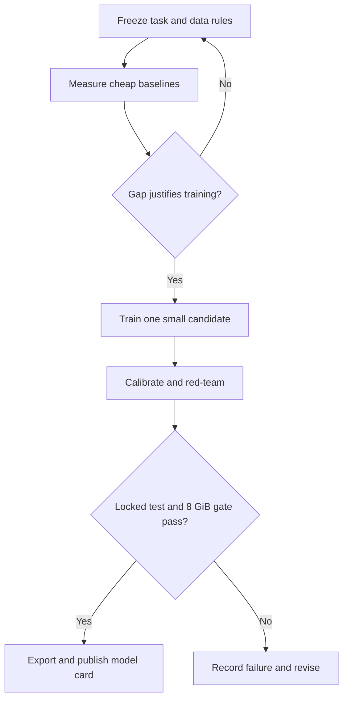

# Research roadmap and spending gates

**[Home](../README.md) · [Plain explanation](start-here.md) · [Design](architecture.md) · [Evaluation](evaluation.md) · [Executable next steps](next-steps.md)**

| Phase | Artifact | Exit gate |
| --- | --- | --- |
| 0. Scope | [Matched comparison contract](next-steps.md#0-freeze-the-comparison-contract), target CPU, workload and error costs | Frozen schema/splits/metrics/hardware; no claim without named comparison conditions. |
| 1. Audit | Dataset cards, split manifests, competitor revisions, one independent evidence workload | Rights and leakage checked; holdout untouched; baseline contract runs end to end. |
| 2. Matched baselines | CPU quality/latency/RSS for direct scorer, Laya shortlist, Kev if eligible, and current controls | Identify an evidenced gap on same examples/hardware; otherwise stop. |
| 3. No-training discriminator | Compare fixed evidence coverage/counterevidence routes to confidence-only and always-verify | Coverage-aware route wins paired quality–latency frontier and survives negation/missing-evidence slices. |
| 4. Prototype | One small model, one changed variable, one-batch smoke then short pilot | Only unlock if phase 3 identifies a trainable failure; retain gain on an independent-source workload. |
| 5. Red-team and deploy | Calibration, adversarial slices, full-process 8 GiB CPU and separate quantized 4 GiB profile | Pass registered risk, quality, memory and latency criteria; test remains sealed until freeze. |
| 6. Report | Reproducible method, source pins, raw metrics, accessible summary and model/data cards | Qualified claim with hardware/task/quality uncertainty; publish failures as well as wins. |

Follow the detailed [next-step plan](next-steps.md). Before any long run, write an [experiment record](../templates/experiment.md): hypothesis, single changed variable, exact hashes, time/cost estimate, maximum spend and stop trigger. First run a one-batch forward/backward/save/load/inference smoke. Inspect stratified development errors before a full epoch. Measure a pilot epoch before setting a budget; **no cost number here authorizes spending**. Read the locked test only after registering a final candidate.

When the baseline exists, add `src/revv/` (schema/model/adapters), `tests/` (contract and export parity), `bench/` (hardware and raw metrics), `experiments/` (immutable manifests) and `docs/results/` (plain summaries and technical cards). Commit scripts, configurations and small metrics; retain large datasets/checkpoints in versioned artifact storage with hashes and rights. Every result page links to its experiment record and raw metrics, and back to the [plain explanation](start-here.md).

**Questions for the project owner at phase 0:** reference local machine, decision domain and error costs, initial English-only scope, whether 8 GiB constrains system RAM, accelerator memory or both, and the available experiment budget. Working assumptions: x86 CPU process RSS, English text and support/policy decisions; a second quantized <4 GiB profile. These can change without discarding the research framework.
