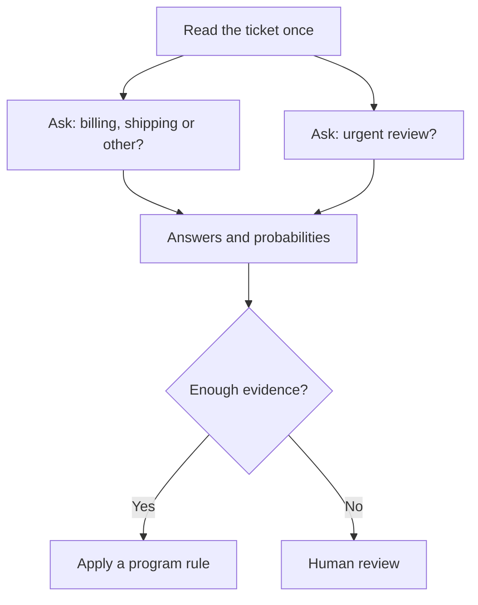

# The idea in plain English

**[Home](../README.md) · [Technical design](architecture.md) · [Evaluation](evaluation.md)**

A help desk receives: “My parcel is late, and I was charged twice.” A decision model can answer “Which team should see this?” and “Does this need urgent review?” It returns answer probabilities; ordinary program rules or a person choose the action. A probability is useful only if it reflects real error rates on the work at hand.

Our first candidate reads shared text once, then compares each question and answer option with that reading. This may save work when several questions concern one document. It might also miss negation, exceptions, or a decisive detail buried late in the text. [The design](architecture.md) explains both the proposal and its falsifying tests.

The main local limit is **under 8 GiB peak memory for the entire process**, including the tokenizer, runtime and working buffers. We will also test a **quantized under-4 GiB version** for smaller devices. This is a separate profile: quantization might change both speed and answers. A small model file alone does not prove either version fits. The first reference device is a laptop-class CPU. We will measure cold start, warm requests, multiple questions and long text separately; GPU and hosted API timings get their own comparisons. [See the memory and compute arithmetic](feasibility.md).

The first phase covers **English text**, yes/no, choices among supplied options, and ordered scores. It must be able to say “none of these” or “insufficient evidence” where appropriate. “Decision” here means judging supplied text against a criterion; it does not mean open-ended planning or unlimited factual recall. We will measure other languages before claiming to support them.

To win, the model must fit, answer new and difficult cases correctly, give trustworthy probabilities, and be faster **on the same machine** as a comparable model. [Evaluation rules](evaluation.md) and the [roadmap](roadmap.md) spell that out. **Current status: research plan only.**
