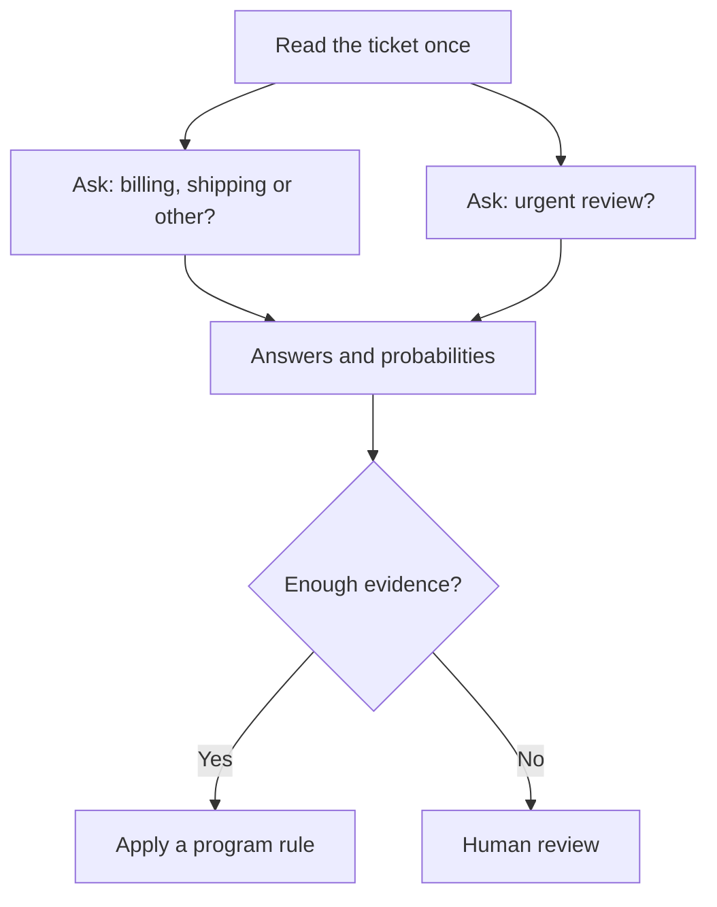

# The idea in plain English

**[Home](../README.md) · [Technical design](architecture.md) · [Evaluation](evaluation.md)**

A help desk receives: “My parcel is late, and I was charged twice.” A decision model can answer “Which team should see this?” and “Does this need urgent review?” It returns answer probabilities; ordinary program rules or a person choose the action. A probability is useful only if it reflects real error rates on the work at hand.

Our first candidate reads shared text once, then compares each question and answer option with that reading. This may save work when several questions concern one document. It might also miss negation, exceptions, or a decisive detail buried late in the text. [The design](architecture.md) explains both the proposal and its falsifying tests.

The main local limit is **under 8 GiB peak memory for the entire process**, including the tokenizer, runtime and working buffers. We will also test a **quantized under-4 GiB version** for smaller devices. This is a separate profile: quantization might change both speed and answers. A small model file alone does not prove either version fits. The first reference device is a laptop-class CPU. We will measure cold start, warm requests, multiple questions and long text separately; GPU and hosted API timings get their own comparisons. [See the memory and compute arithmetic](feasibility.md).

The first phase covers **English text**, yes/no, choices among supplied options, and ordered scores. It must be able to say “none of these” or “insufficient evidence” where appropriate. “Decision” here means judging supplied text against a criterion; it does not mean open-ended planning or unlimited factual recall. We will measure other languages before claiming to support them.

To win, the model must fit, answer new and difficult cases correctly, give trustworthy probabilities, and be faster **on the same machine** as a comparable model. [Evaluation rules](evaluation.md) and the [roadmap](roadmap.md) spell that out. No trained neural decision model has been validated, and local CPU deployment has not yet been measured.

## What the first experiments found

| Plain-English question | Finding on public development data | What it means |
| --- | --- | --- |
| Can a small frozen encoder recognize short requests? | With examples of each intent from training, **91%** of 1,497 known requests were classified correctly; it rejected **43 of 50** unknown requests. | Promising starting point. It has not been compared fairly with existing decision models on a new source or local CPU. [Details](../experiments/kaggle/2026-09-27-prototype-screen.md). |
| Does comparing individual words help by itself? | Untrained token matching did **worse** than a simple sentence summary and cost more scoring work in the GPU pilot. | Save this complexity until a trained version shows a reason for it. [Details](../experiments/kaggle/2026-09-27-frozen-matching.md). |
| Can we find relevant clauses in a long contract? | Matching question words found a marked contradiction clause among five candidates about half the time. Examples of marked clauses from training raised this to about **95%**. | Finding a clause is easier with examples, but it does **not** answer whether the contract supports or contradicts a claim. Only about **64%** of positive cases have *every* marked clause in the first five. [Details](../experiments/data/2026-09-27-contractnli-evidence-prototypes.md). |

The first matched three-way classifier rose from **68.85% to 70.20%** accuracy when given better-retrieved clauses, but the uncertainty interval includes no gain. A per-question guess from training frequencies alone already reached **68.08%**. An established frozen language-inference model scored on the **same retrieved clauses** reached **70.01%** and did worse at contradictions. Finding a relevant clause is not enough: the model still has to interpret support, contradiction and absence. We are pausing neural architecture training while we check why the strong retrieval result is not turning into a strong decision. The [live handoff](../codex/RESUME.md) has exact runs, failures and the next gate; the [idea ledger](ideas.md) explains what could disprove the architecture.
