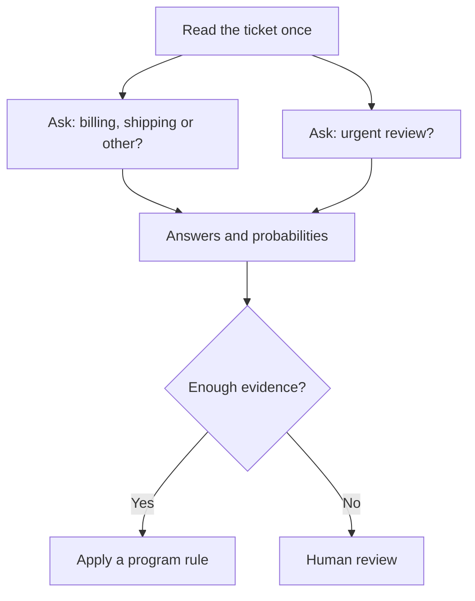
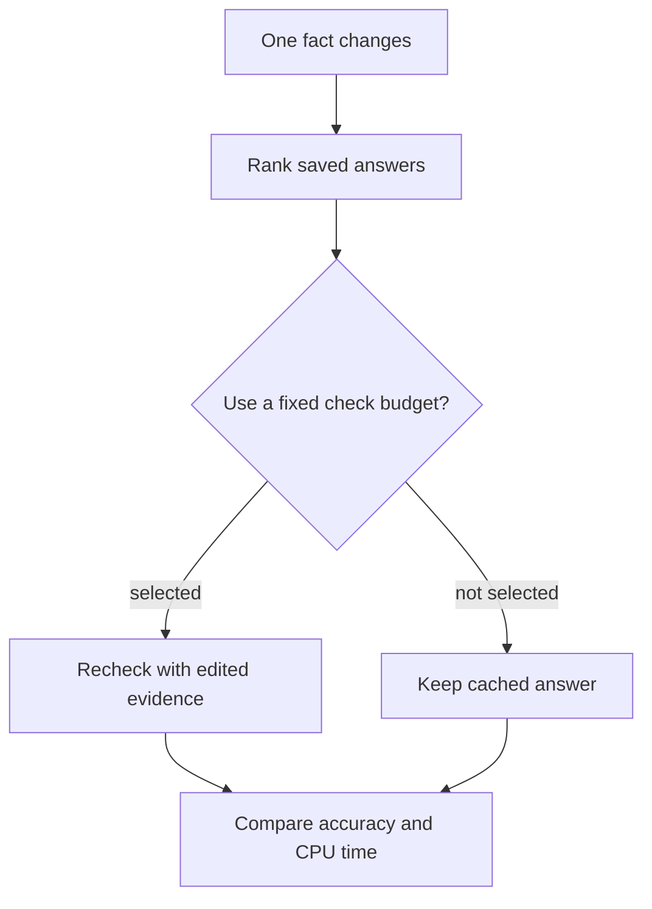

# The idea in plain English

**[Home](../README.md) · [Technical design](architecture.md) · [Evaluation](evaluation.md)**

A help desk receives: “My parcel is late, and I was charged twice.” A decision model can answer “Which team should see this?” and “Does this need urgent review?” It returns answer probabilities; ordinary program rules or a person choose the action. A probability is useful only if it reflects real error rates on the work at hand.

The sharper idea we will screen combines a shared state encoding, cheap typed/evidence scores, verified fact-edit masks, and a risk-gated verifier that spends extra compute only on fields likely to benefit. AdaMTL already has task-aware compute over a shared encoder; QA cascades and Nimble cover related pieces. We will treat this as a research hypothesis, not a novelty claim. Keep it only if it improves local CPU risk/latency against fixed cascades and compact models. [The plain-language novelty audit](novelty-audit.md), [technical derivation](architecture.md), [research map](research.md) and [gated test plan](next-steps.md) explain the idea and falsifiers.

The first model-based edit-refresh screen is still inconclusive: the free Kaggle job stayed queued through 100 checks and timed out before inference, so it produced no model scores. We then completed a preregistered, model-free screen using the existing original synthetic generator (256 states, 32 rule-composition groups). On held-out 20-question bundles at a half-refresh budget, 610 of 620 stale errors in the uniform-edit case were already present before the edit; only 10 were newly caused by it. That means this run mostly diagnoses a weak symbolic starting point, not a useful learned decision model. The edit-specific clues also exploit repeated vocabulary in the synthetic templates. [Read the result and limits](../experiments/data/2026-09-28-refresh-value-screen.md), [frozen protocol](../experiments/data/2026-09-28-refresh-value-screen-prereg.md), and [next steps](next-steps.md).

The closest related real-data checks remain constrained: NormWorlds-CF has no verified public release or separate use terms, and CF-TriviaQA's upstream content rights and original/edit pairing remain unresolved. We have not used either in the primary screen. [NormWorlds-CF access note](../experiments/data/2026-09-27-normworlds-cf-access-preflight.md) · [CF-TriviaQA access note](../experiments/data/2026-09-27-cf-triviaqa-access-preflight.md). The next discriminator needs a credible, distinct imperfect cached predictor and refresher, a separate count of edit-induced errors, and rights-cleared paired edits.

The main local limit is **under 8 GiB peak memory for the entire process**, including the tokenizer, runtime and working buffers. We will also test a **quantized under-4 GiB version** for smaller devices. This is a separate profile: quantization might change both speed and answers. A small model file alone does not prove either version fits. The first reference device is a laptop-class CPU. We will measure cold start, warm requests, multiple questions and long text separately; GPU and hosted API timings get their own comparisons. [See the memory and compute arithmetic](feasibility.md).

The first phase covers **English text**, yes/no, choices among supplied options, and ordered scores. It must be able to say “none of these” or “insufficient evidence” where appropriate. “Decision” here means judging supplied text against a criterion; it does not mean open-ended planning or unlimited factual recall. We will measure other languages before claiming to support them.

To win, the model must fit, answer new and difficult cases correctly, give trustworthy probabilities, and be faster **on the same machine** as a comparable model. [Evaluation rules](evaluation.md) and the [roadmap](roadmap.md) spell that out. No trained neural decision model has been validated, and local CPU deployment has not yet been measured.

## What the first experiments found

| Plain-English question | Finding | What it means |
| --- | --- | --- |
| Can a small frozen encoder recognize short requests? | With examples of each intent from training, **91%** of 1,497 known requests were classified correctly; it rejected **43 of 50** unknown requests. | Promising starting point. It has not been compared fairly with existing decision models on a new source or local CPU. [Details](../experiments/kaggle/2026-09-27-prototype-screen.md). |
| Does comparing individual words help by itself? | Untrained token matching did **worse** than a simple sentence summary and cost more scoring work in the GPU pilot. | Save this complexity until a trained version shows a reason for it. [Details](../experiments/kaggle/2026-09-27-frozen-matching.md). |
| Can we find relevant clauses in a long contract? | Matching question words found a marked contradiction clause among five candidates about half the time. Examples of marked clauses from training raised this to about **95%**. | Finding a clause is easier with examples, but it does **not** answer whether the contract supports or contradicts a claim. Only about **64%** of positive cases have *every* marked clause in the first five. [Details](../experiments/data/2026-09-27-contractnli-evidence-prototypes.md). |

| Can we build reliable change masks? | A small synthetic integrity probe created 256 rule states in 32 composition groups and passed five checks. | This verifies answer/proof/mask plumbing only; it does not measure a model's quality or speed. [Details](../experiments/data/2026-09-27-intervention-mask-probe.md). |
| Can an edit clue identify answers newly made wrong? | On held-out synthetic Q=20 bundles, label-change and word-overlap clues caught all 10 new errors in the uniform edit sample at half budget. | Only 10 new errors occurred; 610 of 620 total stale errors already existed before the edit, and template vocabulary makes the clues unusually easy. This is a mechanism diagnostic, not model evidence. [Details](../experiments/data/2026-09-28-refresh-value-screen.md). |
| Can a cheap word search find all the proof clauses? | On held-out generated rule compositions, it found at least one proof clause in the first five for every supported query, but all proof clauses for only 24%. | This is a synthetic TF-IDF result, not user text or model accuracy. It flags evidence coverage as a gating metric. [Details](../experiments/data/2026-09-27-intervention-retrieval-floor.md). |

The first matched three-way classifier rose from **68.85% to 70.20%** accuracy when given better-retrieved clauses, but the uncertainty interval includes no gain. A per-question guess from training frequencies alone already reached **68.08%**. An established frozen language-inference model scored on the **same retrieved clauses** reached **70.01%** and did worse at contradictions. On cases where the answer was known to be either support or contradiction, replacing retrieved clauses with the **correct marked clauses** raised its accuracy from **57.65% to 67.92%**; even then it fell below an **84.53%** always-support guess on raw accuracy. The marked-clause result is an **oracle diagnosis**, not a working model: real requests do not supply the correct clauses or the answer type. Better evidence helped, but interpreting that evidence still needs work. We are pausing neural architecture training while we test cheaper controls. [Exact diagnosis](../experiments/kaggle/2026-09-27-nli-gold-stances.md) · [Live handoff](../codex/RESUME.md) · [Idea ledger](ideas.md).

The cheap [evidence check](../experiments/data/2026-09-27-contractnli-evidence-shuffle.md) supports that caution: the three-way classifier scored **70.20%** with its own contract clauses, **68.08%** with only the fixed question, and **66.35%** after replacing its clauses with another contract's. Reading the right contract helps a little and changing clauses changes answers; the improvement missed the preset bar for further model training. These are public development results, not a local speed or reliability claim.

A further literature check found that testing whether a small, meaningful edit changes a model’s answer is already established: the 2020 [Contrast Sets work](novelty-audit.md#eighth-overlap-pass-contrast-sets-and-local-decision-boundaries) probes decision boundaries this way across ten tasks. Our narrower question is whether spending extra work to refresh an edited, saved answer prevents enough real mistakes to justify its CPU cost. Contrast Sets does not establish that answer, and its datasets are not assumed cleared for reuse. We reused the repository’s original deterministic edit generator for a preregistered, model-free mechanism screen rather than making a duplicate fixture. Its dominant failure is now clear: the symbolic cache is already wrong on most fields before edits. The next test needs a stronger, distinct imperfect predictor/refresher and realistic paired edits with verified rights; this synthetic result cannot prove everyday-text quality or speed. [Screen results](../experiments/data/2026-09-28-refresh-value-screen.md) · [Dataset fit and rights review](../experiments/data/2026-09-27-edit-benchmark-selection.md).
