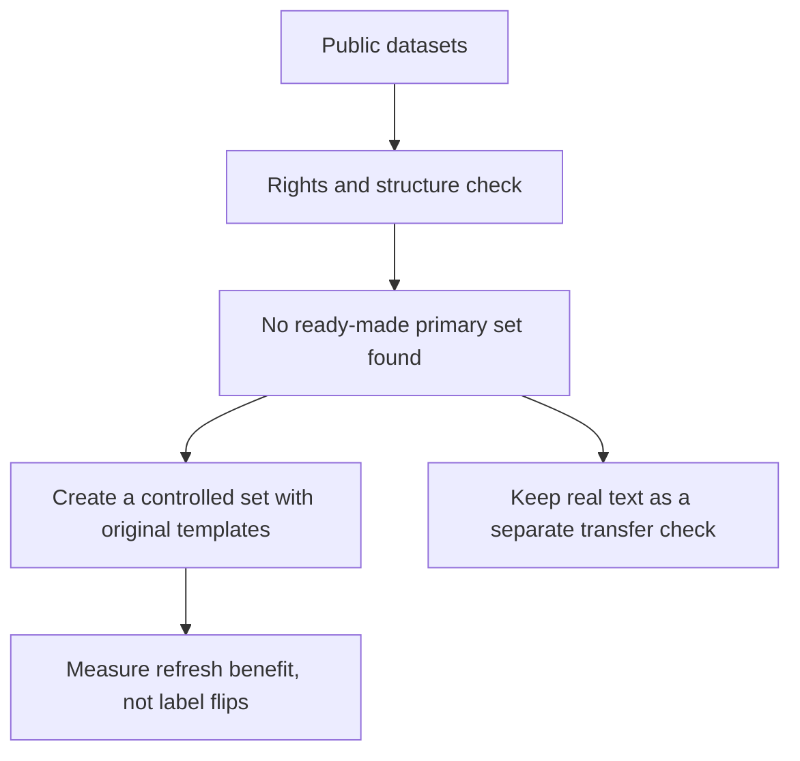

# Edited-state benchmark selection: rights and fit preflight

**Status:** desktop literature/access preflight complete; no dataset downloaded in this pass. No external candidate is yet cleared as the primary paired-edit, multi-output benchmark.

**Navigation:** [Friendly overview](../../docs/start-here.md) · [Novelty audit](../../docs/novelty-audit.md) · [Source ledger](../../docs/sources.md) · [Next steps](../../docs/next-steps.md) · [Codex handoff](../../codex/RESUME.md)

## In plain English

We need to know whether rechecking a saved answer after an edit is worth the extra work. A useful test needs the same document before and after a small edit, several decisions about that document, trustworthy answers for both versions, and permission to use the text. A handful of public datasets each supplies only part of that recipe.

The immediate choice is a small, original, deterministic benchmark for **mechanism testing**, plus a separate real-text transfer test only when edits and their labels can be verified. The controlled set can prove that our bookkeeping and policies behave as intended; it cannot prove usefulness on ordinary user documents.

## What a primary benchmark must contain

| Requirement | Why it matters |
| --- | --- |
| A parent state and a minimally edited child state | The question is what changes after an edit, not general classification accuracy. |
| Multiple typed decisions over each same state | Otherwise the experiment cannot test which cached fields are worth refreshing. |
| Gold labels for both states, with an exact affected-field set | It separates a genuine label change from unrelated fields, and exposes bad edit masks. |
| A nontrivial stale predictor and a distinct refresh verifier | If either is perfect or they are the same system, refresh value is trivial or circular. |
| Grouped splits by underlying state/template/source | Prevents an original world or near-duplicate edit from leaking into test. |
| Explicit data provenance and terms | Publicly downloadable does not by itself mean the text can be redistributed or used in a public artifact. |
| Measured policy overhead and verifier cost | A selector is useful only if its end-to-end quality/cost frontier improves. |

## Candidate screen

| Candidate | Useful property | Blocking gap | Decision |
| --- | --- | --- | --- |
| [RuleTaker](https://github.com/allenai/ruletaker) / related ProofWriter releases | The official code can generate natural-language theories, query them with a theorem prover, and retain labels/proofs. The format can support several questions about one theory. | The repository's Apache-2.0 statement is for the software; the README links a separate dataset archive without separate data terms. The official RuleTaker page describes synthetic examples augmented with some crowdsourced data. Do not infer a dataset license from the code license or a third-party mirror. | Design precedent only until the archive's rights are clarified. Write a small independent generator rather than copying data or templates. |
| [Counterfactually Augmented Data (CAD)](https://github.com/acmi-lab/counterfactually-augmented-data) | Human-written edits aim to flip labels while avoiding unrelated changes; it offers a useful linguistic stress-test pattern. | Each NLI example is a premise/hypothesis decision, not a bundle of multiple typed questions over one shared state. Its repo has an Apache-2.0 license, while the SNLI source corpus is CC BY-SA 4.0; per-example provenance and compatible downstream terms need to be checked before redistribution or mixing. | Prior art and possible later text diagnostic; not the primary multi-field refresh test. |
| [ContractNLI](https://stanfordnlp.github.io/contract-nli/) | Real contracts have 17 hypotheses per document and three labels, so it is a strong multi-output context test; its site states CC BY 4.0 terms. | It does not supply paired minimal document edits with updated labels or affected-field masks. Creating those labels requires a separately audited annotation procedure. | Existing no-edit real-text benchmark and possible transfer test; do not describe it as an edit-refresh benchmark. |
| [Contrast Sets](https://aclanthology.org/2020.findings-emnlp.117/) and [collection](https://github.com/allenai/contrast-sets) | Establishes small meaningful edits as a way to probe local decision boundaries. | Task-specific datasets do not provide a common multi-field edited-state protocol or an umbrella rights grant. | Prior art and design reference; see [S81](../../docs/sources.md#dataset-rights-and-benchmark-fit-preflight). |
| [CF-TriviaQA](cf-triviaqa-access-preflight.md) | Public counterfactual question/paragraph/answer examples. | Upstream question/document rights and original-to-edit links remain unresolved; schema lacks the original passage/edit operation; one answer per example. | Secondary only if rights and pair provenance are resolved. |

The key distinction is **rights and fit are separate gates**. RuleTaker is especially useful for design because its generator and theorem-prover produce labels, but the linked archive is not automatically covered by the code license. CAD has useful human edits, but not the required question bundle. ContractNLI gives a real multi-question document and a stated dataset license, but no paired edit labels.

## Chosen low-cost path

1. **Mechanism set:** reuse the existing [in-repository deterministic generator](../../analysis/intervention_probe.py) and its [mask-integrity probe](2026-09-27-intervention-mask-probe.md). It already creates typed question bundles, one-fact paired edits, exact labels, proof traces and a stable held-out rule-composition split. Do not create a duplicate or import third-party data for this mechanism check.
2. **Independent groups:** keep each parent world and its edited children together. Preserve the generator's held-out composition groups and report seen and held-out results separately. Retain bundle sizes Q=1, 5, 20 and separate uniform-edit from edit-conditioned positive-control strata.
3. **Separate signal from value:** first test whether signals find fields whose labels flip. Then test whether they find fields where an actual refresh reduces loss. A label flip can make a correct old prediction wrong, or leave an incorrect old prediction incorrect, so flip recall is not expected benefit.
4. **Policy baselines:** compare stale-cache, refresh-all, local-edit refresh, calibrated confidence/margin, edit/query similarity, label-flip rank, and a cross-fitted expected-benefit selector. Include an oracle selector only as an upper bound.
5. **Verifier ladder:** start with a deterministic oracle refresher to measure the maximum possible benefit on the controlled set. Then replace it with a distinct, imperfect compact verifier; measure both verifier errors and selector errors. Never present the oracle result as model performance.
6. **Real-text transfer:** use ContractNLI only for its licensed no-edit multi-field baseline until a rights-reviewed process creates paired edits and independently verifies every affected label. CAD/Contrast Sets remain separate diagnostics, subject to provenance and terms review.
7. **Timing gate:** report paired gold loss before/after refresh, refresh calls, whole-policy CPU p50/p95 and peak RSS. Charge edit parsing, selector, compaction and verifier work. Test on one named laptop CPU before making a speed claim.

The primary target for field (q) is signed benefit:
[
b_q = ell(\hat y_q^{\mathrm{stale}}, y_q^{\mathrm{edited}})
      - \ell(\hat y_q^{\mathrm{refresh}}, y_q^{\mathrm{edited}}).
]
A policy should select a field only when its cross-fitted estimate of (b_q) exceeds the measured incremental refresh cost under the registered quality/cost objective. Report negative benefits too: refresh can make an answer worse.

## Stop conditions

- If all refreshers are oracle-perfect or stale outputs are made artificially weak, the experiment is only an upper bound; add a distinct compact model before deciding the architecture.
- If benefit is predictable only because the generator directly exposes the edit target, remove that shortcut and rerun on held-out templates.
- If bundle-level shared work dominates or one hard field forces full recomputation, stop optimizing per-field routing and profile the actual bottleneck.
- If no real-text paired-label set passes provenance, annotation and rights checks, report the limitation; do not imply synthetic success transfers to user documents.
- Do not schedule training or another GPU run until the free-provider preflight starts promptly and the CPU-side discriminator can change a concrete decision.

## Follow-up CPU mechanism screen

The existing generator was reused in the [28 September value-of-refresh screen](2026-09-28-refresh-value-screen.md). At Q=20 and half-budget on held-out compositions, the unproved-output signal avoided 443/620 post-edit errors in the uniform stratum, versus 310 expected from random selection. The post-hoc audit found 610 of those 620 errors were already present before the edit; only 10 were newly introduced. The screen therefore exposes a weak-predictor confound and does not establish a useful refresh model. See the [pre-registered method](2026-09-28-refresh-value-screen-prereg.md), [aggregate results](2026-09-28-refresh-value-screen.json) and [error decomposition](2026-09-28-refresh-value-screen-redteam.json).

## Research records

The access findings and boundaries are recorded in [S82–S84](../../docs/sources.md#dataset-rights-and-benchmark-fit-preflight). The current Kaggle edit-risk screen remains inconclusive: its recovery timed out while the exact kernel was QUEUED and no inference artifact exists. This benchmark choice does not retroactively turn that screen into a result.
