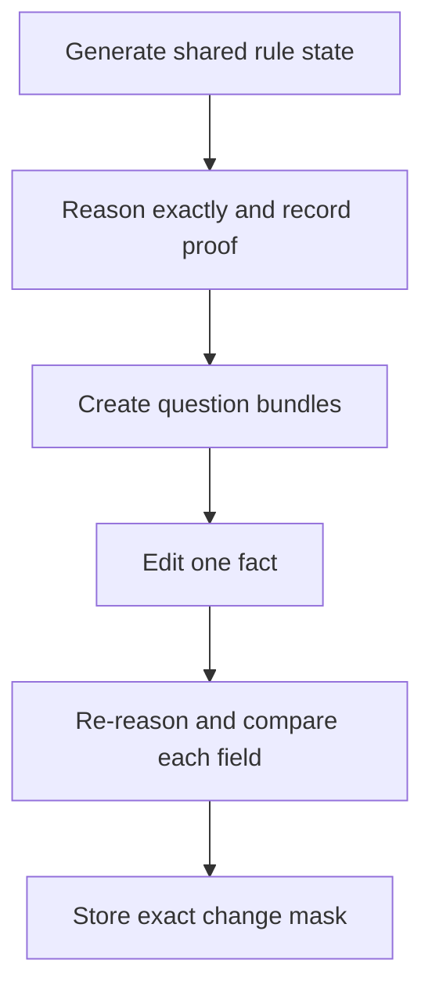

# Intervention-mask generator smoke

**[Plain-English overview](../../docs/start-here.md) · [Gated research plan](../../docs/next-steps.md) · [Codex handoff](../../codex/RESUME.md)**

**Status: passed data-integrity checks; no model-quality or speed result.** This is the first small artifact for the intervention-supervised, risk-gated verifier hypothesis. It tests whether we can generate grouped typed questions, exact labels and proof evidence, and single-fact edits with correct field-change masks. It does not test a neural model.

**Plain English:** We made 256 small rule-based situations, asked 20 yes/no/unknown questions about each one, and changed one fact. A deterministic reasoner supplied the answers and proof trails. We checked that the mask marks exactly the questions whose answers changed. This verifies the dataset plumbing only.

## Why this probe comes first

The proposed model would reuse one state representation across several decision fields, then spend extra compute selectively. Before a model run, we need examples where (a) the correct outputs are known, (b) edits reveal which fields are affected, and (c) proof evidence can be checked exactly. This probe provides that controlled input. The synthetic language and rules cannot establish natural-language transfer or benchmark performance.

## Method

- 256 states, with eight variations per rule-composition group: 32 groups total.
- Each state has six entities, twelve predicates, an acyclic rule graph, explicit positive or negative facts, and 20 unique question fields.
- Questions are nested into bundle sizes $Q=1,5,20$.
- A deterministic forward-chaining reasoner assigns `true`, `false`, or `unknown`. Each entailed answer stores the supporting fact and rule IDs and proof depth.
- Each state has two one-fact edit samples:
  - `uniform_candidate_sample`: sampled uniformly from available one-fact additions/removals; no-effect edits remain in this sample.
  - `effective_edit_sample`: sampled from one-fact edits that change at least one of the 20 queried labels. This is a positive-control stratum, **not** a prevalence estimate.
- Composition groups are assigned to `seen_composition` or `heldout_composition` using a stable hash of the rule graph. 48 states (6 groups) are held out by composition; no model has been fit on either split.
- Seed: `20260927`. No external dataset or pretrained model was used.

## Results

| Check | Result |
| --- | ---: |
| Generated states / rule-composition groups | 256 / 32 |
| Seen / held-out composition states | 208 / 48 |
| Median proof depth among entailed fields | 4 |
| Uniform edit sample with no changed label among 20 fields | 204/256 (79.7%) |
| Uniform edit sample changing at least one of 20 labels | 52/256 (20.3%) |
| Effective positive-control sample with a changed label | 256/256 (by construction) |
| Unit checks | 5 passed |

The uniform-edit no-effect rate is a property of this generator's candidate edits, query selection, and rule grammar. It is not an estimate of how often real user updates affect a decision. The effective sample is intentionally conditioned on a change and must not be pooled with the uniform sample to estimate prevalence.

The mask invariants passed for both strata: for every field, `should_change` equals whether its exact pre-edit and post-edit labels differ. Proof traces and group splits are reproducible from the seed and script. A first version selected the least-impact edit and created artificial sparsity; that version was discarded before these reported results. The final version samples candidate edits uniformly and reports a separately labeled positive-control stratum.

## Artifacts and reproducibility

- Generator: [`analysis/intervention_probe.py`](../../analysis/intervention_probe.py)
- Invariant tests: [`analysis/test_intervention_probe.py`](../../analysis/test_intervention_probe.py)
- Machine-readable summary: [`2026-09-27-intervention-mask-probe.json`](2026-09-27-intervention-mask-probe.json)
- Regenerate all 256 exact records: `python analysis/intervention_probe.py --states 256 --composition-group-size 8 --output-dir experiments/data/intervention-probe`
- The generated JSONL is deterministic and is intentionally not checked into Git; its SHA-256 is in the summary. The code, seed, summary and tests are the durable record.

## Limits and next gate

This result validates a synthetic label/proof/mask pipeline only. It does not evaluate a retriever, verifier, router, model, latency, memory, calibration, or intervention robustness. It cannot establish novelty.

Next, run a frozen-backbone response-surface probe: compare cheap shared scoring, a fixed evidence-verifier path, a confidence-only gate, and a task-risk gate; report an oracle ceiling separately. Before any training, require recoverable gold-label errors, adequate evidence recall, and enough measured per-field verifier cost for routing to save end-to-end CPU time. If any of those conditions fails, reject or revise this candidate without using Kaggle GPU time.
