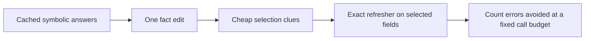

# CPU value-of-refresh signal screen

**Status:** completed as an exploratory, model-free mechanism screen. No trained model, third-party data, GPU, or paid compute was used.

**Navigation:** [Plain-English overview](../../docs/start-here.md) · [Preregistration](2026-09-28-refresh-value-screen-prereg.md) · [Benchmark fit decision](2026-09-27-edit-benchmark-selection.md) · [Generator integrity probe](2026-09-27-intervention-mask-probe.md) · [Novelty audit](../../docs/novelty-audit.md) · [Codex handoff](../../codex/RESUME.md)

## In plain English

We tested whether a cheap clue can tell us which saved answers need checking after a fact changes. The controlled examples have exact answers, so a perfect checker gives an optimistic ceiling.

An “answer changed” clue and direct word overlap found all of the small number of errors newly caused by edits in the held-out synthetic examples at a half-refresh budget. But the one-round cached predictor was already wrong on most fields before any edit. A simple “the cheap answer is still unproved” clue therefore looked best on overall errors, mostly because it found those older mistakes. The result does **not** show that a new model or refresh architecture works on real text.



## What we ran

- Reused the existing original in-repository generator rather than adding a second synthetic dataset.
- Generated 256 states, 32 rule-composition groups, 20 fields per state, and two separately reported edit strata: a uniform candidate edit and an edit conditioned on changing at least one answer.
- Evaluated seen compositions (208 states, 26 groups) and held-out compositions (48 states, 6 groups), with nested bundle sizes Q=1, 5, and 20.
- Used direct facts plus one simultaneous rule-propagation round as the deliberately limited cached predictor. Used full exact closure as the refresher and gold oracle.
- Compared post-edit shallow label change, an unproved-output uncertainty proxy, edit/query token Jaccard, analytical random selection, and an oracle ranking at equal field-refresh-call budgets.
- Ran 10 standard-library unit tests. Repeated the full fixed-seed screen; its 10,240 field-level score rows matched exactly.

The frozen protocol is in the [preregistration](2026-09-28-refresh-value-screen-prereg.md). The executable screen is [analysis/refresh_value_screen.py](../../analysis/refresh_value_screen.py), with [tests](../../analysis/test_refresh_value_screen.py). Its output uses equal refresh-call counts, **not measured CPU cost**.

## Main result: held-out compositions, Q=20, half of fields refreshed

Each row summarizes 48 held-out state bundles (960 fields) in one edit stratum. The perfect refresher can only correct an incorrect cached label, so these counts are optimistic.

| Edit stratum | Errors after edit if nothing is refreshed | Already wrong before edit and still wrong | New errors caused by edit | Gold labels that changed | Errors avoided: unproved clue | Cheap label-change clue | Edit/query overlap | Random expected | Overall-error oracle |
| --- | ---: | ---: | ---: | ---: | ---: | ---: | ---: | ---: | ---: |
| Uniform candidate | 620 | 610 | 10 | 19 | 443 | 318 | 279 | 310 | 477 |
| Effective-edit positive control | 623 | 581 | 42 | 80 | 432 | 318 | 277 | 311.5 | 478 |

The effective-edit stratum is selected by construction and **does not estimate how often real edits affect a decision**.

## Red-team interpretation

For the uniform held-out stratum, 610 of 620 post-edit stale errors (98.4%) were already wrong before the edit and stayed wrong. In the effective-edit control, 581 of 623 (93.3%) persisted from before the edit. This happened because a one-round symbolic reasoner is a weak predictor of the full logic closure. Therefore the strong overall result for the unproved-output clue mainly measures correction of a weak baseline, not selective response to edits.

The post-hoc decomposition asks a narrower question: among fields whose cached output was correct before the edit, how many newly become wrong after it? At the same half-budget:

| Held-out stratum | New edit-induced errors | Cheap label-change clue catches | Edit/query overlap catches | Unproved clue catches | Random expected | Overall-error oracle catches |
| --- | ---: | ---: | ---: | ---: | ---: | ---: |
| Uniform candidate | 10 | 10 | 10 | 4 | 5 | 8 |
| Effective-edit positive control | 42 | 42 | 42 | 17 | 21 | 30 |

A separate edit-induced oracle would catch all 10 or 42, respectively; it is an unachievable upper bound. The cheap label-change clue and word overlap look perfect on this sample, but the uniform count is only 10 events, and the synthetic questions and edit sentences reuse the same entity/property vocabulary. This is an easy template cue and a direct form of edit sensitivity, which is established prior art. It is not evidence of a learned risk model or a novel architecture.

The overall-error oracle can miss newly induced errors because it spends its limited budget on the much larger set of pre-existing errors. This confirms we must report **both total refresh benefit and edit-induced regressions**, and use a credible cached model before claiming the refresh policy is useful.

## Decision

The screen passes code/data plumbing and exposes a measurable confound. It fails as evidence for the target model mechanism:

- the cache predictor and refresher are symbolic reasoners, not neural models;
- most measured errors predate the edit;
- the best edit-specific cues exploit the generated templates;
- the refresher is perfect and equal-cost per selected field;
- no natural-language generalization, calibration, wall-clock cost, CPU p95, memory, or model comparison was measured.

Do not use this result to justify training or claim selective-refresh novelty. Keep it as a control and use it to shape the next discriminator: a stronger, distinct imperfect cached predictor and verifier; a separately measured edit-induced error slice; and, before any real-text claim, rights-cleared paired edits with multiple fields per document.

## Reproducibility

- Aggregate policy results: [JSON](2026-09-28-refresh-value-screen.json)
- Post-hoc error decomposition and capture counts: [JSON](2026-09-28-refresh-value-screen-redteam.json)
- Preregistered method: [Markdown](2026-09-28-refresh-value-screen-prereg.md)
- Screen script SHA-256: 7b8f0bbcbe65abb2b8def65b3e3dca8683922cf606bb2db937918905f8de2389
- Generator SHA-256: 1da34a30725a2b8a2296416cde5de69ac6477cd9fd0089dfe97701d34211ecc8
- Field-score JSONL SHA-256: 7c3da3ca9d755445ce07813d30adb388aeb8042da049d8c4de0670833cfe8141
- The compressed field-level score file is [available in the repo](2026-09-28-refresh-value-scores.jsonl.gz); regenerate it alongside the aggregate using the command below.
- Regenerate with:
  ```sh
  python analysis/refresh_value_screen.py --seed 20260928 --states 256 --composition-group-size 8 --output-dir experiments/data/refresh-value-screen
  ```
- Re-run the post-hoc decomposition with:
  ```sh
  python analysis/refresh_value_redteam.py --seed 20260928 --states 256 --composition-group-size 8 --output experiments/data/2026-09-28-refresh-value-screen-redteam.json
  ```
